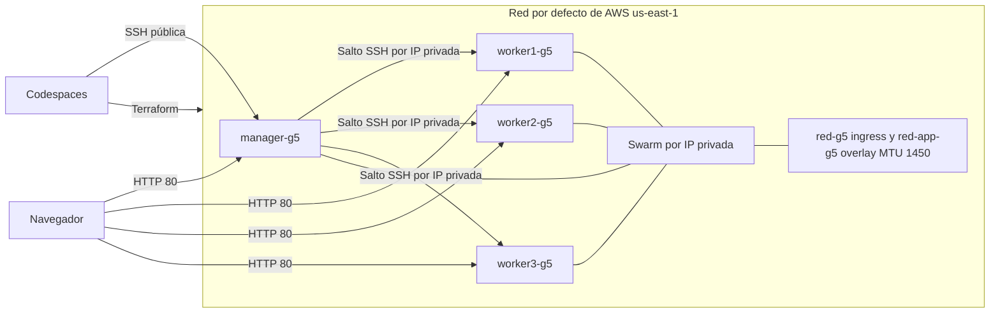

# Arquitectura CLOUD del grupo 5

```mermaid
flowchart LR
    CS[Codespaces] -->|SSH pública| M[manager-g5]
    CS -->|Terraform| AWS
    WEB[Navegador] -->|HTTP 80| M & W1 & W2 & W3
    subgraph AWS[Red por defecto de AWS us-east-1]
        M -->|Salto SSH por IP privada| W1[worker1-g5] & W2[worker2-g5] & W3[worker3-g5]
        M --- SW[Swarm por IP privada]
        W1 & W2 & W3 --- SW
        SW --- O[red-g5 ingress y red-app-g5 overlay MTU 1450]
    end
```
